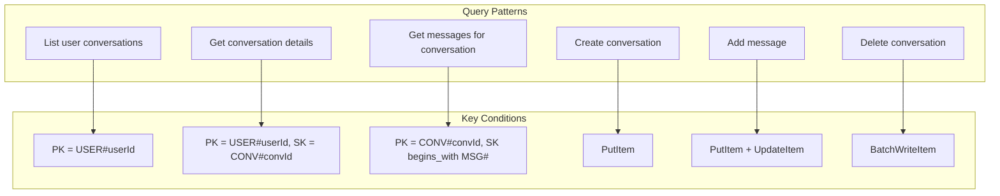
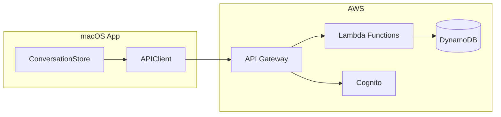

# Chat History Storage with DynamoDB

## Recommendation: DynamoDB (Single-Table Design)

DynamoDB is the optimal choice for this use case because:

- **Serverless**: No infrastructure to manage, automatic scaling
- **Cost-effective**: Pay-per-request pricing ideal for variable chat traffic
- **Low latency**: Single-digit millisecond response times
- **AWS ecosystem**: Integrates seamlessly with existing Cognito auth and Lambda functions
- **Already in dependencies**: `@aws-sdk/client-dynamodb` and `@aws-sdk/lib-dynamodb` are already installed

## Database Schema

### Single-Table Design

Using a single DynamoDB table with composite keys for both conversations and messages:

| PK | SK | Attributes |
| ----------------------- | ----------------------------- | ---------------------------------------------------------------- |
| `USER#<userId>` | `CONV#<conversationId>` | title, modelId, createdAt, updatedAt, messageCount |
| `CONV#<conversationId>` | `MSG#<timestamp>#<messageId>` | role, content, timestamp, modelId, isError, errorMessage, userId |

### Access Patterns



### Global Secondary Index (GSI)

- **GSI1**: `userId-updatedAt-index`
  - PK: `userId`
  - SK: `updatedAt`
  - Purpose: List conversations sorted by most recently updated

## Architecture



## Implementation Steps

### Phase 1: DynamoDB Infrastructure

**File: [AWS_Services/cdk/lib/database-stack.ts](../../AWS_Services/cdk/lib/database-stack.ts)** (new)

Create a new CDK stack for the DynamoDB table:

```typescript
const table = new dynamodb.Table(this, "ChatHistoryTable", {
  tableName: "thinktank-chat-history",
  partitionKey: { name: "PK", type: dynamodb.AttributeType.STRING },
  sortKey: { name: "SK", type: dynamodb.AttributeType.STRING },
  billingMode: dynamodb.BillingMode.PAY_PER_REQUEST,
  removalPolicy: cdk.RemovalPolicy.RETAIN,
});

table.addGlobalSecondaryIndex({
  indexName: "GSI1",
  partitionKey: { name: "GSI1PK", type: dynamodb.AttributeType.STRING },
  sortKey: { name: "GSI1SK", type: dynamodb.AttributeType.STRING },
});
```

### Phase 2: Lambda Functions

**File: [AWS_Services/lambda/conversations/index.ts](../../AWS_Services/lambda/conversations/index.ts)** (new)

New Lambda handler with endpoints:

- `GET /conversations` - List all conversations for authenticated user
- `POST /conversations` - Create new conversation
- `GET /conversations/{id}` - Get conversation with messages
- `PUT /conversations/{id}` - Update conversation (rename, update model)
- `DELETE /conversations/{id}` - Delete conversation and all messages
- `POST /conversations/{id}/messages` - Add message to conversation

**File: [AWS_Services/lambda/shared/dynamodb.ts](../../AWS_Services/lambda/shared/dynamodb.ts)** (new)

Shared DynamoDB utilities:

```typescript
// Key generators
export const userKey = (userId: string) => `USER#${userId}`;
export const convKey = (convId: string) => `CONV#${convId}`;
export const msgKey = (timestamp: string, msgId: string) =>
  `MSG#${timestamp}#${msgId}`;

// CRUD operations
export async function createConversation(userId: string, conv: Conversation);
export async function listConversations(userId: string, limit?: number);
export async function getConversation(userId: string, convId: string);
export async function getMessages(convId: string);
export async function addMessage(convId: string, message: Message);
export async function deleteConversation(userId: string, convId: string);
```

### Phase 3: API Gateway Updates

**File: [AWS_Services/cdk/lib/api-stack.ts](../../AWS_Services/cdk/lib/api-stack.ts)**

Add new endpoints to API Gateway:

```typescript
const conversations = api.root.addResource("conversations");
conversations.addMethod("GET", conversationsIntegration, { authorizer });
conversations.addMethod("POST", conversationsIntegration, { authorizer });

const conversation = conversations.addResource("{conversationId}");
conversation.addMethod("GET", conversationsIntegration, { authorizer });
conversation.addMethod("PUT", conversationsIntegration, { authorizer });
conversation.addMethod("DELETE", conversationsIntegration, { authorizer });

const messages = conversation.addResource("messages");
messages.addMethod("POST", conversationsIntegration, { authorizer });
```

### Phase 4: Update Chat Lambda

**File: [AWS_Services/lambda/chat/index.ts](../../AWS_Services/lambda/chat/index.ts)**

Modify to auto-save messages after each chat interaction:

```typescript
// After receiving AI response, save both messages
await addMessage(conversationId, userMessage);
await addMessage(conversationId, assistantMessage);
await updateConversationTimestamp(userId, conversationId);
```

### Phase 5: Swift Client Updates

**File: [ThinkTank-MacOS/ThinkTank/Services/AWS/APIClient.swift](../../ThinkTank-MacOS/ThinkTank/Services/AWS/APIClient.swift)**

Add new API methods:

```swift
func listConversations() async throws -> [ConversationDTO]
func createConversation(_ conversation: ConversationDTO) async throws -> ConversationDTO
func getConversation(_ id: String) async throws -> ConversationDTO
func updateConversation(_ id: String, title: String?, modelId: String?) async throws
func deleteConversation(_ id: String) async throws
```

**File: [ThinkTank-MacOS/ThinkTank/Services/ConversationStore.swift](../../ThinkTank-MacOS/ThinkTank/Services/ConversationStore.swift)**

Update to sync with backend:

```swift
// Load conversations on app launch
func loadConversations() async throws {
    let remoteConversations = try await apiClient.listConversations()
    self.conversations = remoteConversations.map { $0.toConversation() }
}

// Sync after local changes
func syncConversation(_ conversation: Conversation) async throws {
    try await apiClient.updateConversation(conversation.id.uuidString, ...)
}
```

### Phase 6: Update Shared Types

**File: [AWS_Services/lambda/shared/types.ts](../../AWS_Services/lambda/shared/types.ts)**

Add new DTOs:

```typescript
interface ConversationItem {
  PK: string;
  SK: string;
  GSI1PK?: string;
  GSI1SK?: string;
  title: string;
  modelId: string;
  createdAt: string;
  updatedAt: string;
  messageCount: number;
}

interface MessageItem {
  PK: string;
  SK: string;
  role: "user" | "assistant";
  content: string;
  timestamp: string;
  modelId?: string;
  isError?: boolean;
  errorMessage?: string;
  userId: string;
}

interface ConversationDTO {
  id: string;
  title: string;
  modelId: string;
  createdAt: string;
  updatedAt: string;
  messageCount: number;
  messages?: MessageDTO[];
}
```

## Data Migration Considerations

- Existing conversations only exist in client memory
- No migration needed - fresh start with cloud persistence
- Consider adding an "export" feature later for local backup

## Security

- All endpoints protected by Cognito authorizer
- User isolation: queries always filter by authenticated userId
- No cross-user data access possible due to partition key design

## Cost Estimate

DynamoDB On-Demand pricing (us-east-1):

- Write: $1.25 per million requests
- Read: $0.25 per million requests
- Storage: $0.25 per GB/month

For a typical user (100 conversations, 1000 messages):

- Storage: ~1MB = negligible
- Daily usage (50 messages): ~$0.001/day

## Testing Strategy

1. Unit tests for DynamoDB utility functions
2. Integration tests for Lambda endpoints
3. End-to-end tests from Swift client
4. Load testing for concurrent users

## Deployment

To deploy the new infrastructure:

```bash
cd AWS_Services
npm install
npx cdk deploy ThinkTankDatabaseStack ThinkTankApiStack
```

After deployment, update the `AWSConfig.swift` file with any new endpoints if the API URL changes.
