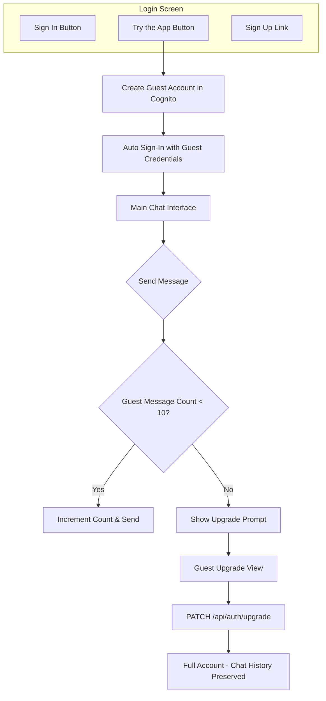

# Guest Trial Mode Implementation Plan

## Overview

Implement a frictionless trial experience for new users:

- Create anonymous guest accounts in Cognito on "Try the App" button tap
- Track message usage (10 free messages)
- Show remaining message count in the UI
- Convert guest accounts to full accounts preserving chat history

## Architecture



## Implementation Details

### 1. CognitoAuthService Enhancements

Update [`ThinkTank-MacOS/ThinkTank/Services/AWS/CognitoAuthService.swift`](ThinkTank-MacOS/ThinkTank/Services/AWS/CognitoAuthService.swift):

- Add guest account properties:
  - `isGuestAccount: Bool` - stored in UserDefaults
  - `guestEmail: String?` - stored for re-auth
  - `guestPassword: String?` - stored for re-auth

- Add new methods following Guidepost pattern:

```swift
/// Create a silent guest account with random credentials
func createGuestAccount() async throws {
    let guestId = UUID().uuidString.lowercased()
    let guestEmail = "guest_\(guestId)@thinktank.guest"
    let guestPassword = generateSecurePassword()

    // Sign up with guest credentials (auto-confirmed via Lambda trigger)
    try await signUp(email: guestEmail, password: guestPassword, fullName: "Guest User")

    // Sign in immediately
    try await signIn(email: guestEmail, password: guestPassword)

    // Mark as guest account and store credentials
    UserDefaults.standard.set(true, forKey: "isGuestAccount")
    UserDefaults.standard.set(guestEmail, forKey: "guestEmail")
    UserDefaults.standard.set(guestPassword, forKey: "guestPassword")
}

/// Upgrade guest account to full account
func upgradeGuestAccount(email: String, password: String, fullName: String) async throws {
    // Call new backend endpoint to update Cognito user
    // Returns new tokens, clears guest flags
}

private func generateSecurePassword() -> String {
    // Generate password meeting Cognito requirements:
    // 8+ chars, uppercase, lowercase, digit
}
```

### 2. Guest Message Tracking

Add to `CognitoAuthService` or create new `GuestStateManager`:

```swift
private let guestMessageCountKey = "com.thinktank.guestMessageCount"
private let maxGuestMessages = 10

var guestMessageCount: Int {
    get { UserDefaults.standard.integer(forKey: guestMessageCountKey) }
    set { UserDefaults.standard.set(newValue, forKey: guestMessageCountKey) }
}

var canGuestSendMessage: Bool {
    !isGuestAccount || guestMessageCount < maxGuestMessages
}

var remainingGuestMessages: Int {
    max(0, maxGuestMessages - guestMessageCount)
}

func incrementGuestMessageCount() {
    if isGuestAccount {
        guestMessageCount += 1
    }
}
```

### 3. Login View Updates

Update [`ThinkTank-MacOS/ThinkTank/Views/Auth/LoginView.swift`](ThinkTank-MacOS/ThinkTank/Views/Auth/LoginView.swift):

Add "Try the App" button with green gradient (matching Guidepost):

```swift
// Sign In Button (existing, update styling)
Button(action: signIn) {
    // ... existing content
}
.background(
    LinearGradient(
        colors: [
            Color(red: 0.063, green: 0.725, blue: 0.506), // #10B981
            Color(red: 0.020, green: 0.588, blue: 0.412)  // #059669
        ],
        startPoint: .leading,
        endPoint: .trailing
    )
)
.shadow(color: Color.brandPrimary.opacity(0.4), radius: 15, x: 0, y: 8)

// Try the App Button (new)
Button(action: tryAsGuest) {
    HStack {
        Image(systemName: "sparkles")
        Text("Try the App")
            .fontWeight(.medium)
    }
    .frame(maxWidth: .infinity)
    .padding(.vertical, 12)
}
.buttonStyle(.plain)
.background(Color(.textBackgroundColor))
.clipShape(RoundedRectangle(cornerRadius: 8))
.overlay(
    RoundedRectangle(cornerRadius: 8)
        .stroke(Color.gray.opacity(0.2), lineWidth: 1)
)

Text("Try with 10 free messages, no sign-up required")
    .font(.system(size: 12))
    .foregroundStyle(.secondary)
```

### 4. Guest Message Banner

Create new file `ThinkTank-MacOS/ThinkTank/Views/Chat/GuestMessageBanner.swift`:

Displays remaining messages for guest users in the chat area:

```swift
struct GuestMessageBanner: View {
    let remainingMessages: Int
    let onUpgrade: () -> Void

    var body: some View {
        HStack {
            Image(systemName: "sparkles")
            Text("\(remainingMessages) free messages remaining")
            Spacer()
            Button("Create Account") { onUpgrade() }
                .buttonStyle(.borderedProminent)
                .tint(Color.brandPrimary)
        }
        .padding()
        .background(Color.brandPrimaryLight.opacity(0.5))
        .clipShape(RoundedRectangle(cornerRadius: 8))
    }
}
```

### 5. Guest Upgrade View

Create new file `ThinkTank-MacOS/ThinkTank/Views/Auth/GuestUpgradeView.swift`:

Form to convert guest to full account:

- Full name field
- Email field
- Password field with requirements
- Confirm password field
- "Create Account" button
- Preserves all chat history (same Cognito user ID)

### 6. ChatView Integration

Update [`ThinkTank-MacOS/ThinkTank/Views/Chat/ChatView.swift`](ThinkTank-MacOS/ThinkTank/Views/Chat/ChatView.swift):

- Check `canGuestSendMessage` before sending
- Show upgrade prompt when limit reached
- Increment message count on successful send
- Show `GuestMessageBanner` when guest user

### 7. Backend: Guest Upgrade Lambda

Create new endpoint in [`AWS_Services/lambda/`](AWS_Services/lambda/):

**Endpoint:** `PATCH /api/auth/upgrade`

**Request:**

```json
{
  "email": "user@example.com",
  "password": "NewPassword123",
  "fullName": "John Doe"
}
```

**Implementation:**

1. Validate current JWT token
2. Extract user sub from token
3. Update Cognito user attributes (email, name)
4. Update password
5. Return new tokens

```typescript
// In new auth Lambda handler
async function upgradeGuestAccount(event: APIGatewayProxyEvent) {
  const userId = getUserId(event);
  const { email, password, fullName } = JSON.parse(event.body);

  // Use AWS SDK to update Cognito user
  await cognito.adminUpdateUserAttributes({
    UserPoolId: process.env.USER_POOL_ID,
    Username: userId,
    UserAttributes: [
      { Name: "email", Value: email },
      { Name: "name", Value: fullName },
      { Name: "email_verified", Value: "true" },
    ],
  });

  // Set new password
  await cognito.adminSetUserPassword({
    UserPoolId: process.env.USER_POOL_ID,
    Username: userId,
    Password: password,
    Permanent: true,
  });

  // Return success (client will re-authenticate)
  return { success: true };
}
```

### 8. CDK Stack Updates

Update [`AWS_Services/cdk/lib/api-stack.ts`](AWS_Services/cdk/lib/api-stack.ts):

- Add new Lambda for auth operations
- Add `PATCH /api/auth/upgrade` route
- Grant Lambda permissions to Cognito user pool

## File Changes Summary

| File | Action |

| ----------------------------------- | ------------------------------------------ |

| `CognitoAuthService.swift` | Modify - add guest account methods |

| `LoginView.swift` | Modify - add "Try the App" button |

| `ChatView.swift` | Modify - integrate guest message tracking |

| `ChatInputView.swift` | Modify - disable when limit reached |

| `ContentView.swift` | Modify - handle guest upgrade sheet |

| `GuestMessageBanner.swift` | Create - remaining messages UI |

| `GuestUpgradeView.swift` | Create - upgrade form |

| `AWS_Services/lambda/auth/index.ts` | Create - auth Lambda with upgrade endpoint |

| `api-stack.ts` | Modify - add auth Lambda and route |

## UI Specifications

**Colors (from Guidepost):**

- Primary green gradient: `#10B981` to `#059669`
- Button shadow: `brandPrimary.opacity(0.4)`
- Banner background: `brandPrimaryLight.opacity(0.5)`

**Message Limit Banner:**

- Shows at top of chat when guest
- Updates in real-time as messages are sent
- Becomes more prominent as limit approaches (color change at 3 remaining)
- Blocks input when limit reached with upgrade prompt

## Testing Considerations

- Test guest account creation flow
- Test message count persistence across app restarts
- Test upgrade flow preserves chat history
- Test edge cases: exactly 10 messages, app killed mid-message
- Test re-authentication with stored guest credentials
