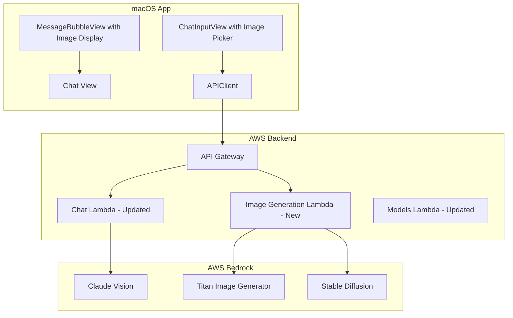

# Image Generation and Understanding Integration Plan

## Use Cases

### 1. Text-to-Image Generation

User provides a text prompt, the app generates an image using AWS Bedrock image models.

**Supported Models:**

- **Amazon Titan Image Generator v2** - AWS native, includes watermarking, background removal, color palette control
- **Stable Diffusion 3.5 Large** - 8.1B parameter model, high-quality 1MP images, versatile styles

**User Flow:**

1. User selects an image generation model from model selector
2. User types a prompt describing the desired image
3. Backend invokes Bedrock image model and returns base64 image
4. App displays the generated image in chat as assistant response

### 2. Image Analysis/Understanding (Vision)

User attaches an image for AI analysis using Claude's multimodal vision capabilities.

**Supported Models:**

- Claude 3.5 Sonnet, Claude 4.5 Sonnet/Opus (already configured in app)

**User Flow:**

1. User clicks the attachment button (currently placeholder)
2. User selects an image from their Mac (JPEG, PNG, WebP, GIF - max 3.75MB)
3. User optionally adds a text prompt (e.g., "What's in this image?", "Extract text from this")
4. Backend sends image + prompt to Claude via multimodal API
5. App displays Claude's text analysis in chat

---

## Architecture Changes



---

## Backend Changes

### 1. New Image Generation Lambda ([lambda/image/index.ts](AWS_Services/lambda/image/index.ts) - new file)

```typescript
interface ImageGenerationRequest {
  conversationId?: string;
  modelId: string; // 'amazon.titan-image-v2' or 'stability.sd3-large'
  prompt: string;
  negativePrompt?: string;
  width?: number; // 512-1024
  height?: number;
  seed?: number; // for reproducibility
}

interface ImageGenerationResponse {
  conversationId: string;
  image: string; // base64 encoded
  seed: number;
}
```

### 2. Update Chat Lambda ([lambda/chat/index.ts](AWS_Services/lambda/chat/index.ts))

Add multimodal message support for Claude:

```typescript
interface MessageContent {
  type: "text" | "image";
  text?: string;
  source?: {
    type: "base64";
    media_type: string;
    data: string;
  };
}

interface Message {
  role: "user" | "assistant";
  content: string | MessageContent[]; // Extended for images
}
```

### 3. Update Models Lambda ([lambda/models/index.ts](AWS_Services/lambda/models/index.ts))

Add image models to the available models list:

```typescript
{
  id: 'amazon.titan-image-generator-v2',
  name: 'Amazon Titan Image Generator v2',
  provider: 'amazon',
  type: 'image-generation',
  capabilities: ['text-to-image', 'image-editing', 'background-removal']
},
{
  id: 'stability.sd3-large',
  name: 'Stable Diffusion 3.5 Large',
  provider: 'stability',
  type: 'image-generation',
  capabilities: ['text-to-image']
}
```

### 4. Update API Stack ([cdk/lib/api-stack.ts](AWS_Services/cdk/lib/api-stack.ts))

- Add `/image` POST endpoint for image generation
- Add IAM permissions for Titan Image and Stable Diffusion model invocation

---

## macOS App Changes

### 1. Update Message Model ([Models/Message.swift](ThinkTank-MacOS/ThinkTank/Models/Message.swift))

```swift
struct Message: Identifiable, Codable, Equatable {
    let id: UUID
    let role: MessageRole
    let content: String
    let timestamp: Date
    let modelId: String?

    // New fields for image support
    let imageData: Data?        // For attached/generated images
    let imageURL: URL?          // For cached images
    let contentType: ContentType

    enum ContentType: String, Codable {
        case text
        case image
        case textWithImage  // User message with image attachment
    }
}
```

### 2. Update ChatInputView ([Views/Chat/ChatInputView.swift](ThinkTank-MacOS/ThinkTank/Views/Chat/ChatInputView.swift))

- Implement the placeholder attachment button with image picker
- Show image preview before sending
- Support drag-and-drop images
- Validate image size (max 3.75MB for Claude vision)

### 3. Update MessageBubbleView ([Views/Chat/MessageBubbleView.swift](ThinkTank-MacOS/ThinkTank/Views/Chat/MessageBubbleView.swift))

- Render images in message bubbles
- Add save/copy image buttons on hover
- Support image zoom/preview modal

### 4. Update APIClient ([Services/AWS/APIClient.swift](ThinkTank-MacOS/ThinkTank/Services/AWS/APIClient.swift))

- Add `sendImageGenerationRequest()` method for text-to-image
- Update `sendMessage()` to support multimodal messages with base64 images
- Add image caching for generated/received images

### 5. Update AIModel ([Models/AIModel.swift](ThinkTank-MacOS/ThinkTank/Models/AIModel.swift))

Add model type and capabilities:

```swift
enum ModelType: String, Codable {
    case textGeneration
    case imageGeneration
    case multimodal  // Text + vision
}

struct AIModel {
    let id: String
    let name: String
    let provider: String
    let type: ModelType
    let capabilities: [String]
}
```

### 6. Update ModelSelectorView ([Views/Chat/ModelSelectorView.swift](ThinkTank-MacOS/ThinkTank/Views/Chat/ModelSelectorView.swift))

- Group models by type (Text, Image, Multimodal)
- Show model capabilities in selector
- Auto-switch UI mode based on selected model type

---

## Implementation Phases

### Phase 1: Image Analysis (Claude Vision)

Lowest effort, highest value - uses existing Claude models.

1. Update Message model with image fields
2. Implement image picker in ChatInputView
3. Update backend Chat Lambda for multimodal messages
4. Update MessageBubbleView to display attached images

### Phase 2: Text-to-Image Generation

New capability using Bedrock image models.

1. Create new Image Generation Lambda
2. Add /image endpoint to API Gateway
3. Add image generation models to models list
4. Update ModelSelectorView to show image models
5. Add image display in MessageBubbleView
6. Add save/share image actions

### Phase 3: Advanced Image Features (Optional)

1. Image editing with masks (Titan v2)
2. Background removal (Titan v2)
3. Image variations
4. Color palette control

---

## File Summary

| File | Action | Description |

| ------------------------------------ | ------ | --------------------------- |

| `lambda/image/index.ts` | Create | New image generation Lambda |

| `lambda/chat/index.ts` | Update | Multimodal message support |

| `lambda/models/index.ts` | Update | Add image models |

| `lambda/shared/types.ts` | Update | Add image types |

| `cdk/lib/api-stack.ts` | Update | Add /image endpoint |

| `Models/Message.swift` | Update | Add image fields |

| `Models/AIModel.swift` | Update | Add model types |

| `Views/Chat/ChatInputView.swift` | Update | Image picker |

| `Views/Chat/MessageBubbleView.swift` | Update | Image display |

| `Views/Chat/ModelSelectorView.swift` | Update | Model grouping |

| `Services/AWS/APIClient.swift` | Update | Image API methods |
