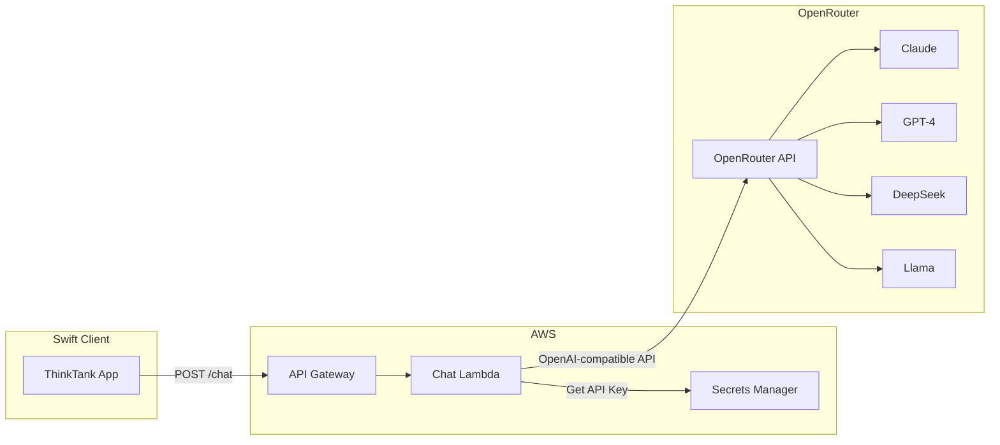

# OpenRouter Integration Plan

This plan migrates ThinkTank from AWS Bedrock to OpenRouter for LLM access. OpenRouter provides a unified, OpenAI-compatible API that gives access to multiple model providers (Anthropic, OpenAI, Meta, Mistral, DeepSeek, etc.) with a single API key.

## Pre-requisites (Manual Steps)

### 1. Create OpenRouter Account

- Go to [openrouter.ai](https://openrouter.ai)
- Sign up with email or OAuth (Google/GitHub)
- Verify your email address

### 2. Add Credits/Payment Method

- Navigate to **Account > Billing**
- Add a payment method (credit card)
- OpenRouter uses pay-as-you-go pricing per token
- Optionally set a spending limit to prevent unexpected charges

### 3. Generate API Key

- Navigate to **Account > Keys** (or https://openrouter.ai/keys)
- Click "Create Key"
- Give it a descriptive name (e.g., "ThinkTank Production")
- Copy the key immediately - it won't be shown again
- Store it securely (you'll add it to AWS Secrets Manager later)

### 4. Review Available Models

- Browse [openrouter.ai/models](https://openrouter.ai/models) to see available models and pricing
- Key models for ThinkTank:
  - `anthropic/claude-sonnet-4` - Fast, intelligent
  - `anthropic/claude-opus-4` - Most capable
  - `anthropic/claude-haiku` - Fastest
  - `deepseek/deepseek-r1` - Advanced reasoning
  - `openai/gpt-4o` - GPT-4 Omni (new option)
  - `meta-llama/llama-3.3-70b-instruct` - Open source

---

## Architecture Changes



**Key changes:**

- Lambda calls OpenRouter's `https://openrouter.ai/api/v1/chat/completions` instead of Bedrock
- API key stored in AWS Secrets Manager (not environment variable)
- Bedrock IAM permissions removed, Secrets Manager permissions added
- OpenRouter uses OpenAI-compatible format (simpler, unified for all models)

---

## Implementation Steps

### Step 1: Store API Key in AWS Secrets Manager

Create a secret in AWS Secrets Manager to store the OpenRouter API key securely.

**Option A: Via AWS Console**

- Open AWS Secrets Manager in us-east-1
- Create new secret > Other type of secret
- Key: `OPENROUTER_API_KEY`, Value: `sk-or-v1-...`
- Secret name: `thinktank/openrouter`

**Option B: Via CDK** (recommended - see Step 2)

### Step 2: Update CDK Stack ([api-stack.ts](AWS_Services/cdk/lib/api-stack.ts))

Changes needed:

- Remove Bedrock IAM permissions (lines 31-42)
- Remove AWS Marketplace permissions (lines 44-55)
- Add Secrets Manager secret import or creation
- Add Secrets Manager read permission for Lambda
- Pass secret ARN as environment variable

```typescript
// Import existing secret (if created manually)
const openRouterSecret = secretsmanager.Secret.fromSecretNameV2(
  this, 'OpenRouterSecret', 'thinktank/openrouter'
);

// OR create new secret (placeholder value, update later)
const openRouterSecret = new secretsmanager.Secret(this, 'OpenRouterSecret', {
  secretName: 'thinktank/openrouter',
  description: 'OpenRouter API key for ThinkTank',
});

// Grant Lambda read access
openRouterSecret.grantRead(lambdaRole);

// Add to Lambda environment
environment: {
  ...commonEnvironment,
  OPENROUTER_SECRET_ARN: openRouterSecret.secretArn,
}
```

### Step 3: Update Chat Lambda ([lambda/chat/index.ts](AWS_Services/lambda/chat/index.ts))

**Major changes:**

- Remove AWS Bedrock SDK imports (lines 2-6)
- Remove BedrockRuntimeClient initialization (line 10)
- Add Secrets Manager SDK for API key retrieval
- Replace `invokeBedrockModel()` with `invokeOpenRouter()`
- Remove provider-specific functions (invokeClaude, invokeTitan, etc.)
- Use unified OpenAI-compatible format for all models

**New implementation:**

```typescript
import {
  SecretsManagerClient,
  GetSecretValueCommand,
} from "@aws-sdk/client-secrets-manager";

const secretsClient = new SecretsManagerClient({ region: process.env.REGION });
let cachedApiKey: string | null = null;

async function getApiKey(): Promise<string> {
  if (cachedApiKey) return cachedApiKey;

  const response = await secretsClient.send(
    new GetSecretValueCommand({
      SecretId: process.env.OPENROUTER_SECRET_ARN,
    }),
  );

  const secret = JSON.parse(response.SecretString!);
  cachedApiKey = secret.OPENROUTER_API_KEY;
  return cachedApiKey!;
}

async function invokeOpenRouter(
  modelId: string,
  messages: Message[],
): Promise<{ content: string; usage?: any }> {
  const apiKey = await getApiKey();

  const response = await fetch(
    "https://openrouter.ai/api/v1/chat/completions",
    {
      method: "POST",
      headers: {
        Authorization: `Bearer ${apiKey}`,
        "Content-Type": "application/json",
        "HTTP-Referer": "https://thinktank.app", // Required by OpenRouter
        "X-Title": "ThinkTank",
      },
      body: JSON.stringify({
        model: modelId, // e.g., "anthropic/claude-sonnet-4"
        messages: messages.map((m) => ({ role: m.role, content: m.content })),
        max_tokens: 4096,
      }),
    },
  );

  const data = await response.json();

  return {
    content: data.choices[0].message.content,
    usage: data.usage
      ? {
          inputTokens: data.usage.prompt_tokens,
          outputTokens: data.usage.completion_tokens,
        }
      : undefined,
  };
}
```

### Step 4: Update Models Lambda ([lambda/models/index.ts](AWS_Services/lambda/models/index.ts))

Update the static model list to use OpenRouter model IDs:

```typescript
const AVAILABLE_MODELS: ModelInfo[] = [
  {
    modelId: "anthropic/claude-sonnet-4",
    displayName: "Claude Sonnet 4",
    provider: "Anthropic",
    maxTokens: 200000,
    streaming: true,
  },
  {
    modelId: "anthropic/claude-opus-4",
    displayName: "Claude Opus 4",
    provider: "Anthropic",
    maxTokens: 200000,
    streaming: true,
  },
  {
    modelId: "anthropic/claude-3.5-haiku",
    displayName: "Claude 3.5 Haiku",
    provider: "Anthropic",
    maxTokens: 200000,
    streaming: true,
  },
  {
    modelId: "deepseek/deepseek-r1",
    displayName: "DeepSeek-R1",
    provider: "DeepSeek",
    maxTokens: 128000,
    streaming: true,
  },
  {
    modelId: "openai/gpt-4o",
    displayName: "GPT-4o",
    provider: "OpenAI",
    maxTokens: 128000,
    streaming: true,
  },
  {
    modelId: "meta-llama/llama-3.3-70b-instruct",
    displayName: "Llama 3.3 70B",
    provider: "Meta",
    maxTokens: 131072,
    streaming: true,
  },
];
```

### Step 5: Update Swift Client Model Definitions ([AIModel.swift](ThinkTank-MacOS/ThinkTank/Models/AIModel.swift))

Update the static model list to match OpenRouter model IDs:

```swift
static let availableModels: [AIModel] = [
    AIModel(
        id: "anthropic/claude-sonnet-4",
        displayName: "Claude Sonnet 4",
        provider: "Anthropic",
        description: "Fast & intelligent",
        maxTokens: 200000,
        supportsStreaming: true
    ),
    AIModel(
        id: "anthropic/claude-opus-4",
        displayName: "Claude Opus 4",
        provider: "Anthropic",
        description: "Most capable",
        maxTokens: 200000,
        supportsStreaming: true
    ),
    // ... additional models
]
```

Add color for OpenAI provider in `providerColor`:

```swift
case "openai":
    return Color(hex: "10A37F")  // OpenAI green
```

### Step 6: Deploy and Test

1. Store the OpenRouter API key in Secrets Manager
2. Deploy CDK stack: `cd AWS_Services && npx cdk deploy --all`
3. Test via curl:

   ```bash
   curl -X POST https://your-api-url/prod/chat \
     -H "Authorization: Bearer <cognito-token>" \
     -H "Content-Type: application/json" \
     -d '{"modelId": "anthropic/claude-sonnet-4", "messages": [{"role": "user", "content": "Hello!"}]}'
   ```

4. Rebuild and run the macOS app

---

## Files to Modify

| File | Changes |

| --------------------------------------------------------------- | ----------------------------------------- |

| [api-stack.ts](AWS_Services/cdk/lib/api-stack.ts) | Remove Bedrock perms, add Secrets Manager |

| [lambda/chat/index.ts](AWS_Services/lambda/chat/index.ts) | Replace Bedrock with OpenRouter API calls |

| [lambda/models/index.ts](AWS_Services/lambda/models/index.ts) | Update model IDs to OpenRouter format |

| [AIModel.swift](ThinkTank-MacOS/ThinkTank/Models/AIModel.swift) | Update model IDs, add OpenAI color |

---

## Benefits of OpenRouter

- **Unified API**: Single OpenAI-compatible format for all providers
- **More models**: Access to OpenAI, Google, Cohere, etc. in addition to current models
- **Simpler code**: No provider-specific formatting logic needed
- **Automatic fallbacks**: OpenRouter can route to backup models if primary is down
- **Cost tracking**: Built-in usage dashboard and rate limiting
- **No AWS Marketplace subscriptions**: Direct access to all models

## Rollback Plan

If issues arise, the Bedrock code can be restored by:

1. Reverting the Lambda code changes
2. Re-adding Bedrock IAM permissions in CDK
3. Deploying the stack
