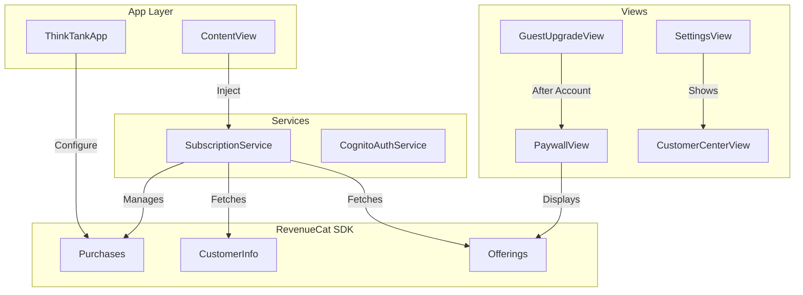
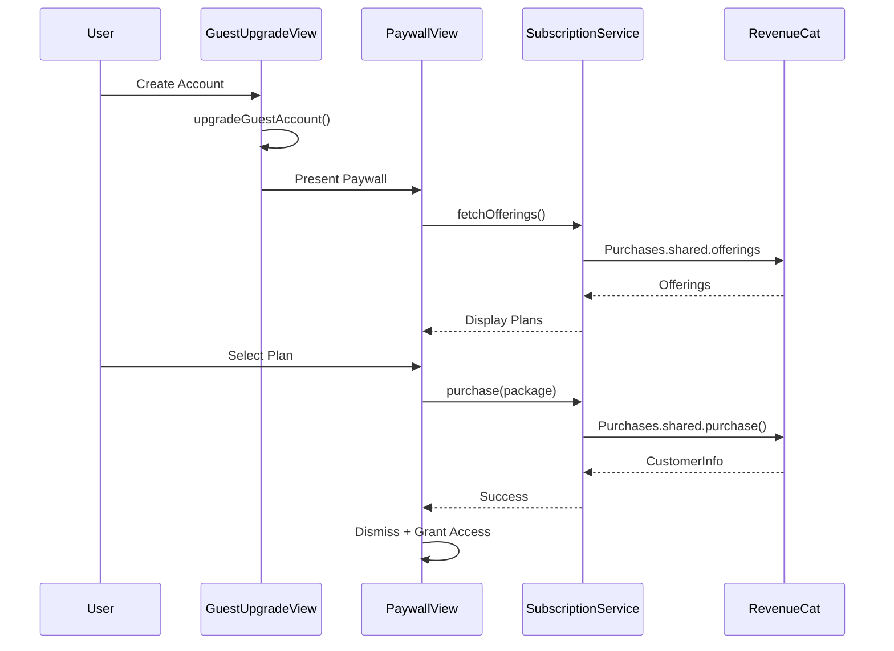

# RevenueCat Subscription Integration Plan

## Architecture Overview



## User Flow



---

## Configuration

**RevenueCat API Key:** `test_RqquTkEvbTbmkhGVQcOjEboPxoH`

**Subscription Plans:**
- Monthly: $5.99/month
- Yearly: $65.00/year

**Entitlement:** `ThinkTank Pro`

---

## 1. Install RevenueCat SDK via Swift Package Manager

Add the RevenueCat SPM package to the Xcode project:

**Package URL:** `https://github.com/RevenueCat/purchases-ios-spm.git`

**Required Products:**

- `RevenueCat` - Core SDK
- `RevenueCatUI` - Paywall UI components

---

## 2. Add In-App Purchase Capability

Update [`ThinkTank-MacOS/ThinkTank/ThinkTank.entitlements`](ThinkTank-MacOS/ThinkTank/ThinkTank.entitlements):

```xml
<key>com.apple.developer.in-app-payments</key>
<array>
    <string>merchant.com.gambrell.ThinkTank</string>
</array>
```

Also enable **In-App Purchase** capability in Xcode project settings.

---

## 3. Create Subscription Models

Create [`ThinkTank-MacOS/ThinkTank/Models/Subscription.swift`](ThinkTank-MacOS/ThinkTank/Models/Subscription.swift):

```swift
enum SubscriptionTier: String, Codable {
    case free
    case pro
}

enum SubscriptionStatus: String, Codable {
    case active
    case expired
    case cancelled
    case none
}
```

---

## 4. Create SubscriptionService

Create [`ThinkTank-MacOS/ThinkTank/Services/SubscriptionService.swift`](ThinkTank-MacOS/ThinkTank/Services/SubscriptionService.swift):

Key responsibilities:

- Configure RevenueCat SDK at app launch
- Identify users with Cognito user ID
- Fetch offerings (Monthly/Yearly packages)
- Handle purchases with error handling
- Restore purchases
- Check "ThinkTank Pro" entitlement
- Listen for CustomerInfo updates

Key properties:

- `@Published var isProUser: Bool`
- `@Published var customerInfo: CustomerInfo?`
- `@Published var offerings: Offerings?`
- `@Published var purchaseInProgress: Bool`

Key methods:

- `configure(apiKey:)` - Initialize SDK
- `login(userId:)` - Identify user after Cognito auth
- `logout()` - Reset anonymous user
- `fetchOfferings()` - Get available packages
- `purchase(package:)` - Execute purchase
- `restorePurchases()` - Restore previous purchases
- `checkProEntitlement()` - Check "ThinkTank Pro" access

---

## 5. Configure RevenueCat at App Launch

Update [`ThinkTank-MacOS/ThinkTank/ThinkTankApp.swift`](ThinkTank-MacOS/ThinkTank/ThinkTankApp.swift):

```swift
import RevenueCat

@main
struct ThinkTankApp: App {
    init() {
        Purchases.logLevel = .debug // Remove in production
        Purchases.configure(withAPIKey: "test_RqquTkEvbTbmkhGVQcOjEboPxoH")
    }
    // ...
}
```

---

## 6. Inject SubscriptionService via Environment

Update [`ThinkTank-MacOS/ThinkTank/ContentView.swift`](ThinkTank-MacOS/ThinkTank/ContentView.swift):

- Add `@State private var subscriptionService = SubscriptionService()`
- Inject via `.environment(subscriptionService)`
- Call `subscriptionService.login(userId:)` after successful Cognito auth
- Call `subscriptionService.logout()` on sign out

---

## 7. Create PaywallView

Create [`ThinkTank-MacOS/ThinkTank/Views/Subscription/PaywallView.swift`](ThinkTank-MacOS/ThinkTank/Views/Subscription/PaywallView.swift):

Two options:

**Option A: RevenueCat Paywall (Recommended)**

Use RevenueCatUI's built-in paywall that you configure in the RevenueCat dashboard:

```swift
import RevenueCatUI

PaywallView()
    .onPurchaseCompleted { customerInfo in
        // Handle success
    }
```

**Option B: Custom Paywall**

Build custom UI displaying:

- Plan comparison (Monthly $5.99/mo vs Yearly $65.00/yr with savings badge)
- Feature list for ThinkTank Pro
- Purchase buttons with loading states
- Restore purchases link
- Terms of service / Privacy policy links

---

## 8. Update GuestUpgradeView Flow

Modify [`ThinkTank-MacOS/ThinkTank/Views/Auth/GuestUpgradeView.swift`](ThinkTank-MacOS/ThinkTank/Views/Auth/GuestUpgradeView.swift):

After successful `upgradeGuestAccount()`:

1. Dismiss the upgrade view
2. Present PaywallView to complete subscription
3. User can skip paywall to use free tier

Update benefits callout to show subscription benefits instead of "Unlimited messages" (which comes with subscription).

---

## 9. Add Subscription Section to Settings

Update [`ThinkTank-MacOS/ThinkTank/Views/Settings/SettingsView.swift`](ThinkTank-MacOS/ThinkTank/Views/Settings/SettingsView.swift):

Add new "SUBSCRIPTION" section after "ACCOUNT":

- Show current tier (Free/Pro)
- Show subscription status and renewal date
- "Upgrade to Pro" button (shows paywall) or "Manage Subscription" button (shows Customer Center)
- "Restore Purchases" button

---

## 10. Add Customer Center Support

Create [`ThinkTank-MacOS/ThinkTank/Views/Subscription/CustomerCenterView.swift`](ThinkTank-MacOS/ThinkTank/Views/Subscription/CustomerCenterView.swift):

Use RevenueCat's CustomerCenter for managing subscriptions:

```swift
import RevenueCatUI

CustomerCenterView()
```

This provides:

- Subscription details
- Cancel/manage subscription
- Request refund
- FAQ and support

---

## 11. Update User Model (Optional)

If you want to display subscription status alongside user info, extend [`ThinkTank-MacOS/ThinkTank/Models/User.swift`](ThinkTank-MacOS/ThinkTank/Models/User.swift) or keep subscription state solely in `SubscriptionService`.

---

## 12. Gate Features Based on Entitlement

Update [`ThinkTank-MacOS/ThinkTank/Views/Chat/ChatView.swift`](ThinkTank-MacOS/ThinkTank/Views/Chat/ChatView.swift):

- Check `subscriptionService.isProUser` for unlimited messages
- Free tier: Limited messages (similar to current guest limit)
- Pro tier: Unlimited messages, all AI models

Update [`ThinkTank-MacOS/ThinkTank/Views/Sidebar/UserProfileView.swift`](ThinkTank-MacOS/ThinkTank/Views/Sidebar/UserProfileView.swift):

- Show "Pro" badge for subscribers
- Show "Free" badge for non-subscribers

---

## Files to Create

- `Models/Subscription.swift` - Subscription enums
- `Services/SubscriptionService.swift` - RevenueCat integration service
- `Views/Subscription/PaywallView.swift` - Subscription selection UI
- `Views/Subscription/CustomerCenterView.swift` - Subscription management

## Files to Modify

- `ThinkTankApp.swift` - Configure RevenueCat SDK
- `ContentView.swift` - Inject SubscriptionService, handle login/logout
- `ThinkTank.entitlements` - Add In-App Purchase capability
- `SettingsView.swift` - Add Subscription section
- `GuestUpgradeView.swift` - Present paywall after account creation
- `ChatView.swift` - Gate features based on entitlement
- `UserProfileView.swift` - Show subscription badge

---

## RevenueCat Dashboard Configuration

Ensure these are configured in RevenueCat dashboard:

- **Products:** `monthly`, `yearly` mapped to App Store Connect products
- **Entitlement:** `ThinkTank Pro` with both products
- **Offering:** Default offering with Monthly and Yearly packages
- **Paywall:** Configure paywall template (if using RevenueCatUI paywall)

---

## Error Handling Strategy

- Network failures: Show retry option, allow offline access for existing subscribers
- Purchase failures: Display specific error messages (cancelled, payment declined, etc.)
- Restore failures: Guide user to contact support
- Entitlement check failures: Default to cached state, retry on next app launch
